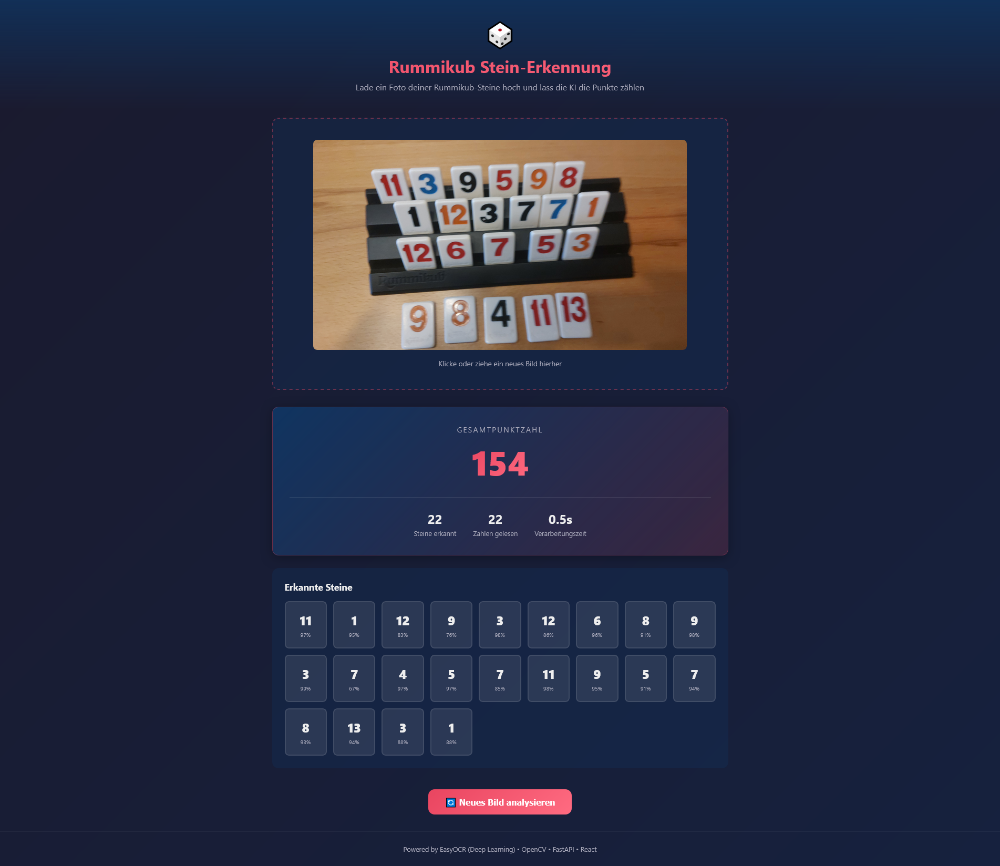

# 🎲 Rummikub Stein-Erkennung

Eine Web-App, die Rummikub-Steine auf Fotos erkennt und deren Punktzahl berechnet.
Nutzt **YOLOv8** für Erkennung und Klassifikation der Steine in einem einzigen Forward Pass.




## 🏗️ Architektur

```
┌──────────────────┐     HTTP/JSON     ┌──────────────────────────┐
│                  │  ◄──────────────► │                          │
│   React Frontend │                   │   FastAPI Backend        │
│   (Vite)         │                   │                          │
│   - Bild-Upload  │                   │   ┌──────────────────┐   │
│   - Ergebnisse   │                   │   │ YOLOv8           │   │
│   - Punkte       │                   │   │ Detection +      │   │
│                  │                   │   │ Klassifikation   │   │
└──────────────────┘                   │   └──────────────────┘   │
                                       │                          │
                                       │   Fallback (ohne YOLO):  │
                                       │   ┌──────────────────┐   │
                                       │   │ OpenCV + CNN     │   │
                                       │   │ Stein-Erkennung  │   │
                                       │   └──────────────────┘   │
                                       └──────────────────────────┘
```

## 🧠 Deep Learning Pipeline

### YOLOv8 (Standard)

Ein eigens trainiertes YOLOv8-Modell erkennt und klassifiziert alle Steine in einem einzigen Forward Pass:

1. **Detection:** Lokalisiert alle Rummikub-Steine im Bild (Bounding Boxes)
2. **Klassifikation:** Erkennt gleichzeitig den Wert (1–13) oder Joker
3. **NMS:** Non-Maximum Suppression filtert überlappende Detektionen

### CNN + OpenCV (Fallback)

Falls kein YOLO-Modell vorhanden ist, wird automatisch auf eine zweistufige Pipeline gewechselt:

1. **OpenCV:** Stein-Segmentierung und Lokalisierung
2. **CNN:** Klassifikation der einzelnen Stein-Ausschnitte

## 🚀 Schnellstart mit Docker

```bash
# Repository klonen
git clone <repo-url>
cd rummiKub-counter

# Mit Docker Compose starten
docker-compose up --build

# App öffnen
# → http://localhost:3000
```

## 💻 Lokale Entwicklung

### Backend

```bash
cd backend

# Virtual Environment erstellen
python -m venv venv
venv\Scripts\activate        # Windows
# source venv/bin/activate   # Mac/Linux

# Dependencies installieren
pip install -r requirements.txt

# Backend starten
uvicorn app.main:app --reload --port 8000
```

> ⚠️ Beim ersten Start werden die YOLO/PyTorch-Abhängigkeiten geladen.

### Frontend

```bash
cd frontend

# Dependencies installieren
npm install

# Dev-Server starten
npm run dev
```

Die App ist dann unter **http://localhost:5173** erreichbar.

## 📡 API-Endpunkte

| Methode | Pfad              | Beschreibung                        |
|---------|-------------------|-------------------------------------|
| `POST`  | `/api/analyze`       | Bild analysieren → Steine + Punkte  |
| `POST`  | `/api/analyze-debug` | Debug-Bild mit Markierungen         |
| `GET`   | `/health`            | Health Check                        |
| `GET`   | `/docs`              | Swagger UI (API-Dokumentation)      |

### Beispiel: Bild analysieren

```bash
curl -X POST http://localhost:8000/api/analyze \
  -F "file=@mein_foto.jpg"
```

### Antwort

```json
{
  "tiles": [
    {"number": 7, "color": "rot", "confidence": 0.95, "is_joker": false},
    {"number": 12, "color": "blau", "confidence": 0.88, "is_joker": false},
    {"number": null, "color": null, "confidence": 0.80, "is_joker": true}
  ],
  "total_score": 49,
  "tile_count": 3,
  "processing_time_ms": 1234.56
}
```

## 📁 Projektstruktur

```
rummiKub-counter/
├── docker-compose.yml
├── backend/
│   ├── Dockerfile
│   ├── requirements.txt
│   └── app/
│       ├── main.py                 # FastAPI App + CORS
│       ├── routers/
│       │   └── analyze.py          # API-Endpunkte
│       ├── services/
│       │   ├── yolo_detector.py    # YOLOv8 Detection + Klassifikation
│       │   ├── cnn_classifier.py   # CNN Fallback-Klassifikation
│       │   ├── tile_detector.py    # OpenCV Stein-Segmentierung (Fallback)
│       │   └── color_detector.py   # HSV Farberkennung
│       ├── models/
│       │   └── schemas.py          # Pydantic Datenmodelle
│       └── utils/
│           └── image_processing.py # Bildvorverarbeitung
├── frontend/
│   ├── Dockerfile
│   ├── nginx.conf
│   ├── package.json
│   └── src/
│       ├── App.jsx                 # Hauptkomponente
│       ├── components/
│       │   ├── ImageUpload.jsx     # Drag & Drop Upload
│       │   ├── ResultDisplay.jsx   # Ergebnis-Anzeige
│       │   └── TileCard.jsx        # Einzelner Stein
│       └── services/
│           └── api.js              # API-Client
└── README.md
```

## 📸 Tipps für beste Erkennung

- **Gute Beleuchtung** – Gleichmäßiges Licht, keine harten Schatten
- **Draufsicht** – Kamera direkt von oben auf die Steine richten
- **Hintergrund** – Einfarbiger, dunkler Hintergrund hilft bei der Segmentierung
- **Abstände** – Steine mit etwas Abstand zueinander legen
- **Schärfe** – Scharfes Foto, kein Verwackeln

## 🛠️ Technologien

- **Frontend:** React 19, Vite 6, Axios
- **Backend:** Python 3.11, FastAPI, Uvicorn
- **KI/ML:** YOLOv8 (Ultralytics), PyTorch, OpenCV
- **Deployment:** Docker, Docker Compose, Nginx, Caddy

## 🌐 VPS-Deployment (Produktion)

### Voraussetzungen

- VPS mit mind. **2 GB RAM** (PyTorch + YOLO brauchen Speicher)
- Docker und Docker Compose installiert
- Eine Domain, die auf die VPS-IP zeigt (A-Record)

### 1. Repository auf den VPS klonen

```bash
ssh user@dein-server
git clone <repo-url>
cd rummiKub-counter
```

### 2. Umgebungsvariablen konfigurieren

```bash
cp .env.example .env
nano .env
```

Die `DOMAIN` auf deine echte Domain setzen (z.B. `rummikub.meinedomain.de`).  
Caddy holt sich automatisch ein Let's Encrypt SSL-Zertifikat.

### 3. Deployment starten

```bash
chmod +x deploy.sh
./deploy.sh
```

Oder manuell:

```bash
docker compose -f docker-compose.prod.yml up -d --build
```

### 4. Überprüfen

```bash
# Container-Status
docker compose -f docker-compose.prod.yml ps

# Logs ansehen
docker compose -f docker-compose.prod.yml logs -f

# Health-Check
curl https://deine-domain.de/health
```

### Architektur in Produktion

```
Internet → Caddy (HTTPS/443) → Nginx (Frontend + /api Proxy) → FastAPI Backend
```

- **Caddy** terminiert SSL (automatisches Let's Encrypt)
- **Nginx** liefert die React-SPA und proxied `/api/` zum Backend
- **FastAPI** verarbeitet die Bilderkennung

### Updaten

```bash
cd rummiKub-counter
git pull
docker compose -f docker-compose.prod.yml up -d --build
```

## 📝 Lizenz

MIT
