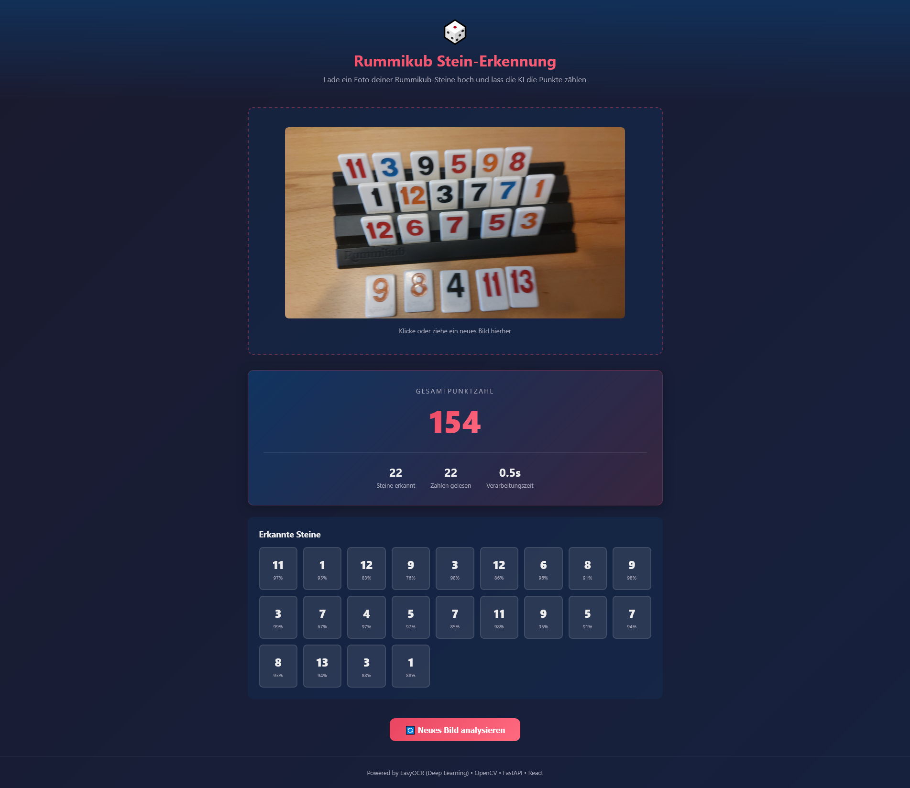

# 🎲 Rummikub Stein-Erkennung

Eine Web-App, die Rummikub-Steine auf Fotos erkennt und deren Punktzahl berechnet.
Nutzt **YOLOv8** für Erkennung und Klassifikation der Steine in einem einzigen Forward Pass, mit automatischer **Orientierungskorrektur** per ResNet-18.


[](https://huggingface.co/datasets/christophrus/rummikub/tree/main)



## 🏗️ Architektur

```
┌──────────────────┐     HTTP/JSON     ┌───────────────────────────────┐
│                  │  ◄──────────────► │                               │
│   React Frontend │                   │   FastAPI Backend             │
│   (Vite)         │                   │                               │
│   - Drag & Drop  │                   │   ┌─────────────────────┐     │
│   - Bild-Upload  │                   │   │ Orientierungs-CNN   │     │
│   - Ergebnisse   │                   │   │ (ResNet-18, 4 Kl.)  │     │
│   - Punkte       │                   │   └────────┬────────────┘     │
│                  │                   │            ▼                   │
└──────────────────┘                   │   ┌─────────────────────┐     │
                                       │   │ YOLOv8 Nano         │     │
                                       │   │ Detection +         │     │
                                       │   │ Klassifikation      │     │
                                       │   │ (14 Klassen)        │     │
                                       │   └─────────────────────┘     │
                                       │                               │
                                       │   Fallback (ohne YOLO):       │
                                       │   ┌─────────────────────┐     │
                                       │   │ OpenCV (7 Strategien│     │
                                       │   │ Stein-Segmentierung)│     │
                                       │   │        +            │     │
                                       │   │ Custom CNN (14 Kl.) │     │
                                       │   └─────────────────────┘     │
                                       └───────────────────────────────┘
```

## 🧠 Deep Learning Pipeline

### Verarbeitungspipeline

```
Bild-Upload → Resize (max 1920px) → Orientierungskorrektur (ResNet-18)
                                              ↓
                              ┌── YOLO-Pfad (Standard) ──┐
                              │  1 Forward Pass:          │
                              │  Detection + Klassi-      │
                              │  fikation (14 Klassen)    │
                              └───────────┬───────────────┘
                                          ↓
                              Punkte-Berechnung → JSON-Response
```

### YOLOv8 Nano (Standard)

Ein eigens trainiertes YOLOv8-Nano-Modell (`rummikub_yolo.pt`) erkennt und klassifiziert alle Steine in einem einzigen Forward Pass:

1. **Detection:** Lokalisiert alle Rummikub-Steine im Bild (Bounding Boxes)
2. **Klassifikation:** Erkennt gleichzeitig den Wert (1–13) oder Joker — 14 Klassen
3. **NMS:** Non-Maximum Suppression filtert überlappende Detektionen
4. **Sortierung:** Ergebnisse werden links-nach-rechts sortiert

### Orientierungskorrektur (ResNet-18)

Ein fine-tuned ResNet-18 erkennt automatisch die Ausrichtung des Bildes und korrigiert sie:

- **4 Klassen:** 0°, 90°, 180°, 270°
- **Input:** 224×224 px (ImageNet-normalisiert)
- **Modell:** `orientation_cnn.pth`

### CNN + OpenCV (Fallback)

Falls kein YOLO-Modell vorhanden ist, wird automatisch auf eine zweistufige Pipeline gewechselt:

1. **OpenCV Stein-Segmentierung** — 7 verschiedene Erkennungsstrategien:
   - Table Diff (LAB-Farbraum), Sättigung, Helligkeit, Multi-Threshold, Local Otsu, Canny Edge, Adaptive Threshold
   - Intelligentes Splitting: Breite/hohe Regionen werden per Sobel-Kantenerkennung aufgeteilt
2. **Custom CNN** — Klassifikation der einzelnen Stein-Ausschnitte:
   - 4-Layer CNN (32→64→128→256 Filter) mit BatchNorm + Dropout
   - Input: 64×96 px RGB, Output: 14 Klassen (1–13 + Joker)
   - Modell: `rummikub_cnn.pth`

### Modelle

| Modell | Architektur | Input | Klassen | Datei |
|--------|-------------|-------|---------|-------|
| YOLO Detector | YOLOv8 Nano | 640×640 | 14 (1–13 + Joker) | `models/rummikub_yolo.pt` |
| Orientierung | ResNet-18 | 224×224 | 4 (0°/90°/180°/270°) | `models/orientation_cnn.pth` |
| CNN Classifier | Custom 4-Layer CNN | 64×96 | 14 (1–13 + Joker) | `models/rummikub_cnn.pth` |

## 🚀 Schnellstart mit Docker

```bash
# Repository klonen
git clone <repo-url>
cd rummikub-counter

# Mit Docker Compose starten
docker-compose up --build

# App öffnen
# → http://localhost:3000
```

## 💻 Lokale Entwicklung

### Backend

```bash
cd backend

# Virtual Environment erstellen
python -m venv venv
venv\Scripts\activate        # Windows
# source venv/bin/activate   # Mac/Linux

# Dependencies installieren
pip install -r requirements.txt

# Backend starten
uvicorn app.main:app --reload --port 8000
```

> ⚠️ Beim ersten Start werden die YOLO/PyTorch-Abhängigkeiten geladen (~500 MB).

### Frontend

```bash
cd frontend

# Dependencies installieren
npm install

# Dev-Server starten
npm run dev
```

Die App ist dann unter **http://localhost:5173** erreichbar.
Der Vite Dev-Server proxied `/api`-Anfragen automatisch an `http://localhost:8000`.

## 📡 API-Endpunkte

| Methode | Pfad | Beschreibung |
|---------|------|--------------|
| `POST` | `/api/analyze` | Bild analysieren → Steine + Punkte |
| `POST` | `/api/analyze-debug` | Debug-Bild mit Bounding Boxes (Base64 PNG) |
| `GET` | `/health` | Health Check (inkl. Erkennungsmodus) |
| `GET` | `/` | Root-Info |
| `GET` | `/docs` | Swagger UI (API-Dokumentation) |

### Beispiel: Bild analysieren

```bash
curl -X POST http://localhost:8000/api/analyze \
  -F "file=@mein_foto.jpg"
```

### Antwort

```json
{
  "tiles": [
    {
      "number": 7,
      "confidence": 0.95,
      "is_joker": false,
      "x": 120,
      "y": 45,
      "width": 38,
      "height": 55
    },
    {
      "number": 12,
      "confidence": 0.88,
      "is_joker": false,
      "x": 200,
      "y": 48,
      "width": 37,
      "height": 54
    },
    {
      "number": null,
      "confidence": 0.80,
      "is_joker": true,
      "x": 280,
      "y": 44,
      "width": 39,
      "height": 56
    }
  ],
  "total_score": 39,
  "tile_count": 3,
  "processing_time_ms": 245.8,
  "image_width": 1920,
  "image_height": 1080
}
```

> Joker zählen **20 Punkte**, Zahlensteine ihren Nennwert (1–13).

## 📁 Projektstruktur

```
rummikub-counter/
├── docker-compose.yml          # Entwicklung
├── docker-compose.prod.yml     # Produktion (mit Caddy)
├── Caddyfile                   # Reverse Proxy + Auto-SSL
├── deploy.sh                   # Deployment-Script
├── TRAINING.md                 # Trainings-Anleitung
│
├── backend/
│   ├── Dockerfile
│   ├── requirements.txt
│   ├── models/                     # Trainierte Modelle
│   │   ├── rummikub_yolo.pt        #   YOLOv8 Nano
│   │   ├── rummikub_cnn.pth        #   Custom CNN (Fallback)
│   │   └── orientation_cnn.pth     #   ResNet-18 Orientierung
│   ├── app/
│   │   ├── main.py                 # FastAPI App, CORS, Startup
│   │   ├── routers/
│   │   │   └── analyze.py          # /api/analyze + /api/analyze-debug
│   │   ├── services/
│   │   │   ├── yolo_detector.py    # YOLOv8 Detection + Klassifikation
│   │   │   ├── cnn_classifier.py   # CNN Fallback-Klassifikation
│   │   │   ├── tile_detector.py    # OpenCV Stein-Segmentierung (7 Strategien)
│   │   │   ├── color_detector.py   # HSV Farberkennung
│   │   │   ├── orientation_detector.py  # ResNet-18 Orientierungskorrektur
│   │   │   └── ocr_service.py      # EasyOCR (deprecated)
│   │   ├── models/
│   │   │   └── schemas.py          # Pydantic Datenmodelle
│   │   └── utils/
│   │       └── image_processing.py # Bildvorverarbeitung + EXIF
│   └── dataset/                    # Training-Tools
│       ├── train_yolo.py           # YOLOv8 Training
│       ├── train_cnn.py            # CNN Training
│       ├── train_orientation.py    # Orientierungs-CNN Training
│       ├── augment_dataset.py      # Daten-Augmentierung (CNN)
│       ├── augment_yolo_rotations.py  # Rotations-Augmentierung (YOLO)
│       └── yolo_dataset/           # YOLO Annotations (train/val/test)
│
└── frontend/
    ├── Dockerfile                  # Multi-Stage Build (Node → Nginx)
    ├── nginx.conf                  # SPA-Routing + API-Proxy
    ├── package.json
    ├── vite.config.js              # Dev-Proxy → localhost:8000
    └── src/
        ├── App.jsx                 # Hauptkomponente + State
        ├── components/
        │   ├── ImageUpload.jsx     # Drag & Drop Upload + Preview
        │   ├── ResultDisplay.jsx   # Ergebnis-Anzeige + Gruppierung
        │   └── TileCard.jsx        # Einzelner Stein (Nummer/Joker)
        └── services/
            └── api.js              # Axios API-Client (120s Timeout)
```

## 📸 Tipps für beste Erkennung

- **Gute Beleuchtung** – Gleichmäßiges Licht, keine harten Schatten
- **Draufsicht** – Kamera direkt von oben auf die Steine richten
- **Hintergrund** – Einfarbiger, dunkler Hintergrund hilft bei der Segmentierung
- **Abstände** – Steine mit etwas Abstand zueinander legen
- **Schärfe** – Scharfes Foto, kein Verwackeln

## 🎓 Eigene Modelle trainieren

Eine ausführliche Trainings-Anleitung mit CNN- und YOLO-Training findet sich in [TRAINING.md](TRAINING.md).

**Kurzübersicht:**

1. **CNN-Training:** 20–30 Bilder pro Klasse → Augmentierung → `python dataset/train_cnn.py`
2. **YOLO-Training:** 100–200 annotierte Gesamtbilder → `python dataset/train_yolo.py`
3. **Orientierungs-CNN:** Automatisch aus YOLO-Daten generiert → `python dataset/train_orientation.py`

## 🛠️ Technologien

| Bereich | Technologie | Version |
|---------|-------------|---------|
| **Frontend** | React | 19.0 |
| | Vite | 6.0 |
| | Axios | 1.7.9 |
| **Backend** | Python | 3.11 |
| | FastAPI | 0.115.6 |
| | Uvicorn | 0.34.0 |
| **KI/ML** | Ultralytics (YOLOv8) | 8.4.23 |
| | PyTorch | 2.x (CPU) |
| | OpenCV | 4.10.0 |
| | Pillow | 12.1.1 |
| **Deployment** | Docker + Docker Compose | |
| | Nginx | Alpine |
| | Caddy | Auto-SSL |

## 🌐 VPS-Deployment (Produktion)

### Voraussetzungen

- VPS mit mind. **2 GB RAM** (PyTorch + YOLO brauchen Speicher)
- Docker und Docker Compose installiert
- Eine Domain, die auf die VPS-IP zeigt (A-Record)

### 1. Repository auf den VPS klonen

```bash
ssh user@dein-server
git clone <repo-url>
cd rummikub-counter
```

### 2. Umgebungsvariablen konfigurieren

```bash
cp .env.example .env
nano .env
```

Die `DOMAIN` auf deine echte Domain setzen (z.B. `rummikub.meinedomain.de`).
Caddy holt sich automatisch ein Let's Encrypt SSL-Zertifikat.

### 3. Deployment starten

```bash
chmod +x deploy.sh
./deploy.sh
```

Oder manuell:

```bash
docker compose -f docker-compose.prod.yml up -d --build
```

### 4. Überprüfen

```bash
# Container-Status
docker compose -f docker-compose.prod.yml ps

# Logs ansehen
docker compose -f docker-compose.prod.yml logs -f

# Health-Check
curl https://deine-domain.de/health
```

### Architektur in Produktion

```
Internet → Caddy (HTTPS/443, Auto-SSL) → Nginx (SPA + /api Proxy) → FastAPI Backend
```

- **Caddy** terminiert SSL (automatisches Let's Encrypt) + HTTP/3
- **Nginx** liefert die React-SPA und proxied `/api/` zum Backend (max 20 MB Upload, 120s Timeout)
- **FastAPI** verarbeitet die Bilderkennung

### Updaten

```bash
cd rummikub-counter
git pull
docker compose -f docker-compose.prod.yml up -d --build
```

## 📝 Lizenz

MIT
